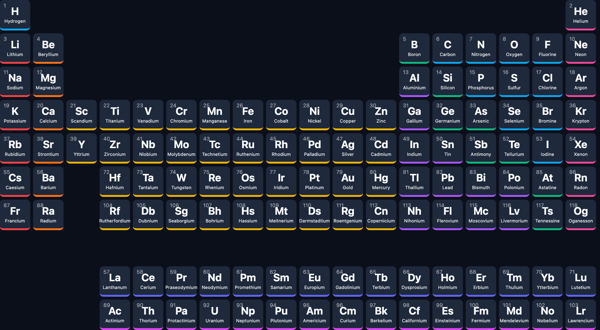

# 🧪 Interactive Periodic Table JS

Responsive and interactive Periodic Table of Elements built with vanilla JavaScript. This project provides a quick and visual way to explore chemical properties, atomic data, and elemental classifications.

## 🚀 Live Demo
Check out the live application here :  
**[https://kbrault.github.io/periodic-table-js/](https://kbrault.github.io/periodic-table-js/)**